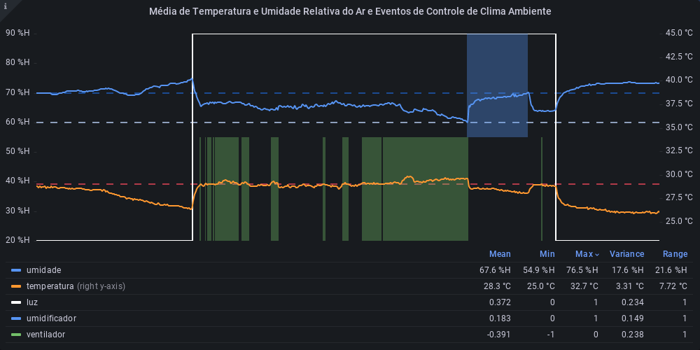

# Estufa Inteligente M5Stack
 Estufa inteligente com soluções automatizadas de IoT.

#### Média de Temperatura e Umidade Relativa do Ar e Estado dos Relés
Eventos de ligar e desligar do ventilador, umidificador e luzes influenciam diretamente no clima ambiente. O gráfico mostra a relação direta entre as variações de medições e ativação dos dispositivos de controle de clima. É um artefato que visa comprovar a eficácia do sistema de automação. 

A umidade relativa do ar deve ficar entre os limites de 60% e 70% enquanto a temperatura deve ficar a baixo de 29 °C. Uma regra é aplicada a cada atualização do sensor de ambiente que envia um evento para o dispositivo *m5envcontrol* ligar ou desligar o umidificador ou o ventilador de acordo com os limites de umidade e temperatura definidos.

**25 a 26 de novembro de 2022**

**24 a 25 de novembro de 2022**

Em dias mais úmidos e amenos, o umidificador fica pouco ligado e em dias mais secos tente a ligar mais vezes durante o dia. 

## Instruções de utilização

Assim que a primeira versão do sistema estiver disponível, deverá complementar com as instruções de utilização. Descreva como instalar eventuais dependências e como executar a aplicação.

Não deixe de informar o link onde a aplicação estiver disponível para acesso.

Se houver usuário de teste, o login e a senha também deverão ser informados aqui (por exemplo: usuário - admin / senha - admin).

O link e o usuário/senha descritos acima são apenas exemplos de como tais informações deverão ser apresentadas.

`Configuração de Ambiente de Desenvolvimento`
`Configuração de Dispositivos`
`Configuração da Infraestrutura`

# Documentação

<ol>
<li><a href="docs/01-documentacao-de-contexto.md"> Documentação de Contexto</a></li>
<li><a href="docs/02-especificacao-do-projeto.md"> Especificação do Projeto</a></li>
<li><a href="docs/03-metodologia.md"> Metodologia</a></li>
<li><a href="docs/04-projeto-de-interface.md"> Projeto de Interface</a></li>
<li><a href="docs/05-arquitetura-da-solucao.md"> Arquitetura da Solução</a></li>
<li><a href="docs/06-template-padrao-da-aplicacao.md"> Template Padrão da Aplicação</a></li>
<li><a href="docs/07-programacao-de-funcionalidades.md"> Programação de Funcionalidades</a></li>
<li><a href="docs/08-plano-de-testes-de-software.md"> Plano de Testes de Software</a></li>
<li><a href="docs/09-registro-de-testes-de-software.md"> Registro de Testes de Software</a></li>
<li><a href="docs/10-plano-de-testes-de-usabilidade.md"> Plano de Testes de Usabilidade</a></li>
<li><a href="docs/11-registro-de-testes-de-usabilidade.md"> Registro de Testes de Usabilidade</a></li>
<li><a href="docs/12-apresentacao-do-projeto.md"> Apresentação do Projeto</a></li>
<li><a href="docs/13-referencias.md"> Referências</a></li>
<li><a href="docs/iot-core.md">IoT Core</a></li>
</ol>

# Código

<li><a href="src/"> Código Fonte</a></li>
<li><a href="src/README.md"> Instruções de utilização</a></li>

# Apresentação

<li><a href="presentation/README.md"> Apresentação da solução</a></li>
