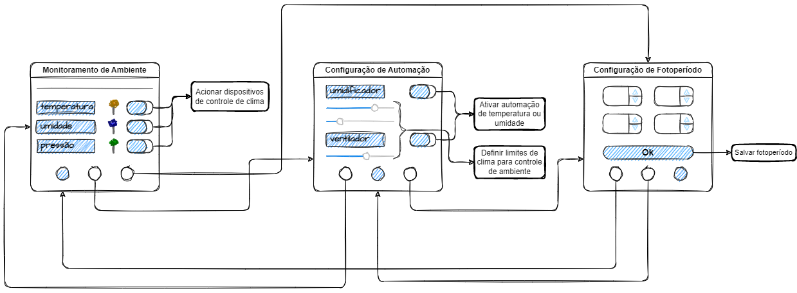

# Projeto de Interface

Pré-requisitos: <a href="2-Especificação do Projeto.md"> Documentação de Especificação</a>

Visão geral da interação do usuário pelas telas do sistema e protótipo interativo das telas com as funcionalidades que fazem parte do sistema (wireframes).

 Apresente as principais interfaces da plataforma. Discuta como ela foi elaborada de forma a atender os requisitos funcionais, não funcionais e histórias de usuário abordados nas <a href="2-Especificação do Projeto.md"> Documentação de Especificação</a>.

## Diagrama de Fluxo

O diagrama apresenta o estudo do fluxo de interação do usuário com o sistema interativo e  muitas vezes sem a necessidade do desenho do design das telas da interface. Isso permite que o design das interações seja bem planejado e gere impacto na qualidade no design do wireframe interativo que será desenvolvido logo em seguida.

O diagrama de fluxo pode ser desenvolvido com “boxes” que possuem internamente a indicação dos principais elementos de interface - tais como menus e acessos - e funcionalidades, tais como editar, pesquisar, filtrar, configurar - e a conexão entre esses boxes a partir do processo de interação. Você pode ver mais explicações e exemplos https://www.lucidchart.com/blog/how-to-make-a-user-flow-diagram.

As referências abaixo irão auxiliá-lo na geração do artefato “Diagramas de Fluxo”.

> **Links Úteis**:
> - [Fluxograma online: seis sites para fazer gráfico sem instalar nada | Produtividade | TechTudo](https://www.techtudo.com.br/listas/2019/03/fluxograma-online-seis-sites-para-fazer-grafico-sem-instalar-nada.ghtml)

## Wireframes

São protótipos usados em design de interface para sugerir a estrutura de um site web e seu relacionamentos entre suas páginas. Um wireframe web é uma ilustração semelhante do layout de elementos fundamentais na interface.
 
> **Links Úteis**:
> - [Protótipos vs Wireframes](https://www.nngroup.com/videos/prototypes-vs-wireframes-ux-projects/)
> - [Ferramentas de Wireframes](https://rockcontent.com/blog/wireframes/)
> - [MarvelApp](https://marvelapp.com/developers/documentation/tutorials/)
> - [Figma](https://www.figma.com/)
> - [Adobe XD](https://www.adobe.com/br/products/xd.html#scroll)
> - [Axure](https://www.axure.com/edu) (Licença Educacional)
> - [InvisionApp](https://www.invisionapp.com/) (Licença Educacional)

# Documentação

<ol>
<li><a href="01-documentacao-de-contexto.md"> Documentação de Contexto</a></li>
<li><a href="02-especificacao-do-projeto.md"> Especificação do Projeto</a></li>
<li><a href="03-metodologia.md"> Metodologia</a></li>
<li><a href="04-projeto-de-interface.md"> Projeto de Interface</a></li>
<li><a href="05-arquitetura-da-solucao.md"> Arquitetura da Solução</a></li>
<li><a href="06-template-padrao-da-aplicacao.md"> Template Padrão da Aplicação</a></li>
<li><a href="07-programacao-de-funcionalidades.md"> Programação de Funcionalidades</a></li>
<li><a href="08-plano-de-testes-de-software.md"> Plano de Testes de Software</a></li>
<li><a href="09-registro-de-testes-de-software.md"> Registro de Testes de Software</a></li>
<li><a href="10-plano-de-testes-de-usabilidade.md"> Plano de Testes de Usabilidade</a></li>
<li><a href="11-registro-de-testes-de-usabilidade.md"> Registro de Testes de Usabilidade</a></li>
<li><a href="12-apresentacao-do-projeto.md"> Apresentação do Projeto</a></li>
<li><a href="13-referencias.md"> Referências</a></li>
<li><a href="iot-core.md">IoT Core</a></li>
</ol>