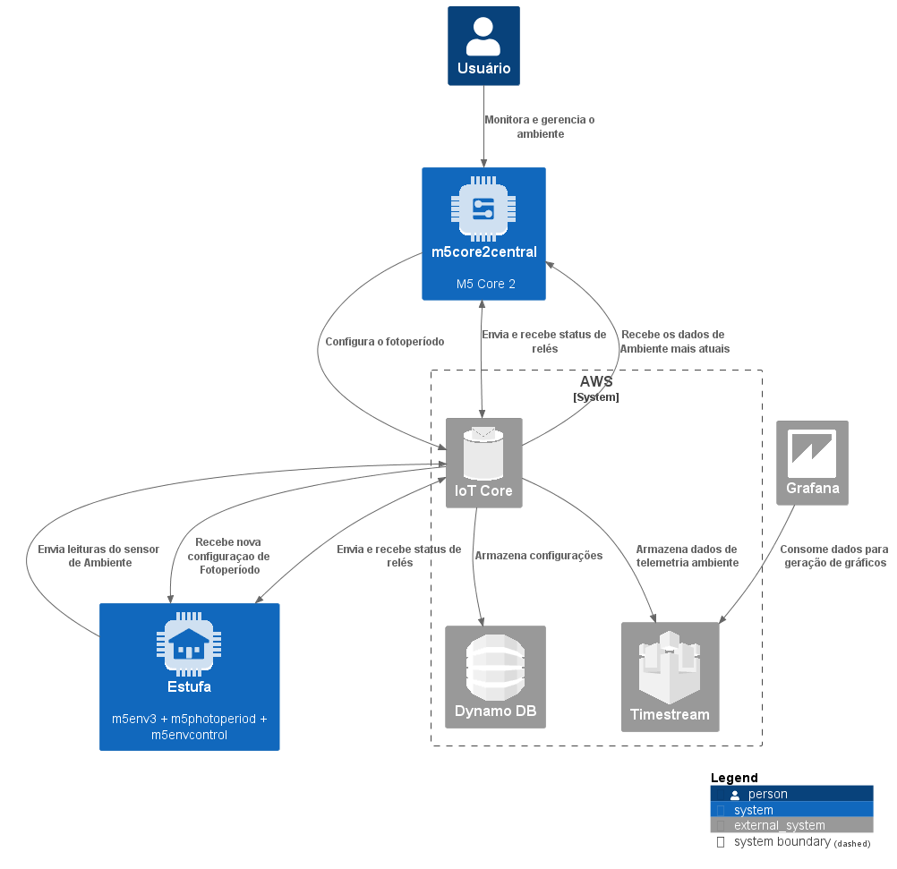
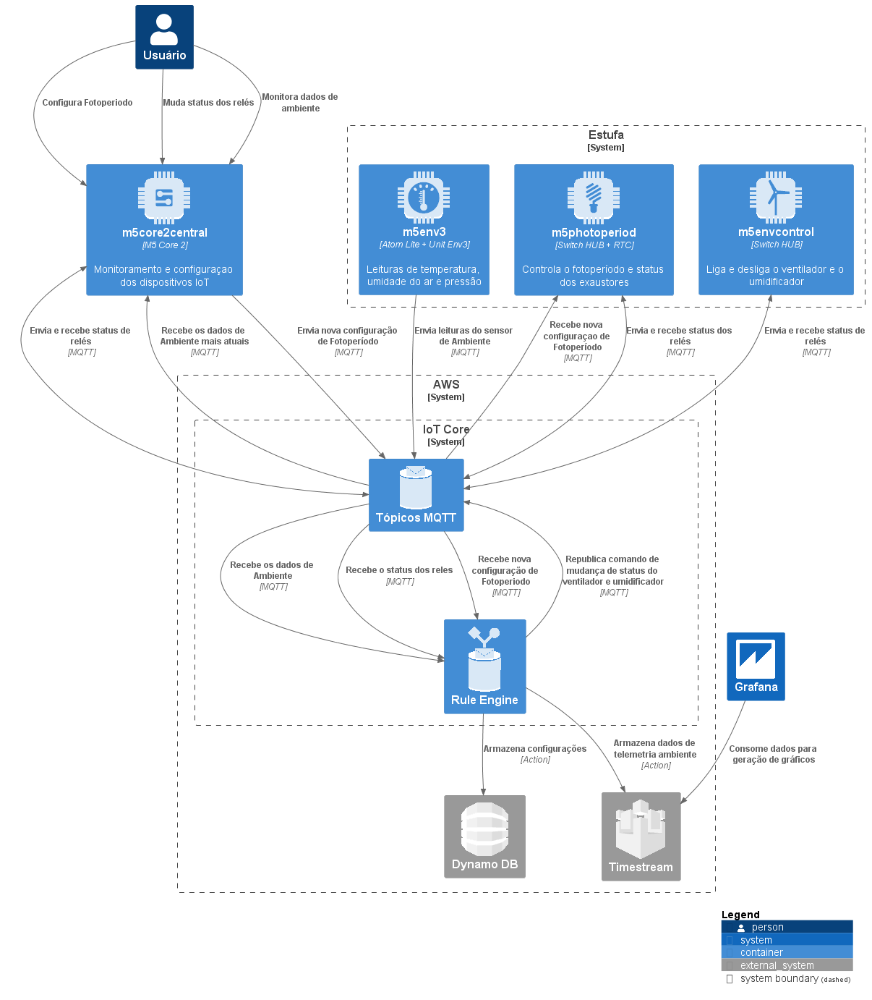

# Arquitetura da Solução
Definição de como o software é estruturado em termos dos componentes que fazem parte da solução e do ambiente de hospedagem da aplicação.
### Microsserviços
A solução utiliza arquitetura de microsserviços para ajudar a manter a disponibilidade da aplicação quando um único componente falha. Numa arquitetura de microsserviços, os componentes da aplicação tem fraco acoplamento. Nesse caso, se um componente falhar, os outros componentes continuam o trabalho pois estão se comunicando uns com os outros. 

O acoplamento fraco ajuda a isolar o comportamento de um componente de outros componentes que dependem dele, aumentando a resiliência e a agilidade. Uma alteração ou uma falha em um dos componentes não deve afetar os outros componentes.
### EDA Event Driven Architecture
O projeto usará EDA como design pattern arquitetural. A comunicação entre os componentes é modelada usando streams de eventos realizando notificações de mudança de estado da aplicação e dos componentes promovendo baixo acoplamento. Eventos são publicados e recebidos por meio de inscrição em determinados eventos por parte dos componentes interessados. De forma que tanto o publisher quanto o subscriber não conheçam a identidade um do outro, ficando esta tarefa por contra do broker.

A assincronicidade promovida pelo padrão Event Driven refere-se a otimização de tempo, onde não temos bloqueios de recurso para o atendimento das requisições como tradicionalmente ocorre em componentes como comunicação síncrona.
### Cloud-Based Deployment Model
Num modelo de deploy Cloud-based, você pode migrar aplicações existentes para a nuvem, ou você pode projetar e construir novas aplicações na nuvem. Essas aplicações podem ser construídas numa infraestrutura de baixo nível e custo e que requeira que o time de TI a gerencie. Alternativamente você pode construir usando serviços de alto nível quer reduzem o gerenciamento, arquitetamento e escalonamento da infraestrutura central.
## Diagrama de Arquitetura
O *C4Model* é usado para visualizar a arquitetura de software do sistema. Ele consiste numa técnica de notação gráfica enxuta para modelar a arquitetura de sistemas de software. Bons diagramas de arquitetura de software ajudam na comunicação das equipes de desenvolvimento, integração eficiente de novos colaboradores, análises e avaliações de arquitetura, identificação de riscos e melhorias.

O modelo é uma abordagem de abstrações que reflete como arquitetos e desenvolvedores pensam e constroem o software. Ele possui 4 níveis de abstração dos diagramas: Contexto, Contêiner, Componente e Código. Só é necessário criar os diagramas que gerem valor ao desenvolvimento do software. Nesse projeto usaremos apenas o diagrama de contexto e contêineres que serão suficientes para visualizar com detalhes a arquitetura de software projetada e a comunicação dos componentes entre si. 
### Diagrama de Contexto do Sistema
O diagrama de contexto exibe um quadro geral com pessoas e sistemas de software, em vez de tecnologias, protocolos e outros detalhes de baixo nível.

 
### Diagrama de Container
O Diagrama de container mostra como as responsabilidades são distribuídas pela arquitetura, as principais opções de tecnologia e como os containers se comunicam entre si. Um container é uma unidade executável ou implantável separadamente que executa código ou armazena dados. 

 
## Tecnologias Utilizadas
Descreva aqui qual(is) tecnologias você vai usar para resolver o seu problema, ou seja, implementar a sua solução. Liste todas as tecnologias envolvidas, linguagens a serem utilizadas, serviços web, frameworks, bibliotecas, IDEs de desenvolvimento, e ferramentas.

Apresente também uma figura explicando como as tecnologias estão relacionadas ou como uma interação do usuário com o sistema vai ser conduzida, por onde ela passa até retornar uma resposta ao usuário.

Nesta seção são apresentados os detalhes técnicos da solução criada pela equipe, tratando dos componentes que fazem parte da solução e do ambiente de hospedagem da solução.
##### AWS IoT Core
O serviço IoT Core exerce mais que a função  de um broker MQTT, ele possui lógicas de negócio,  regras de roteamento de tópicos, ações de gravação de registros na base de dados e registro de dispositivos e certificados. 
## Componentes
Os componentes que fazem parte da solução apresentados no diagrama de arquitetura são exibidos aqui com mais detalhes e informações referentes a suas funcionalidades.
### Tópicos MQTT
Como padronização os tópicos irão usar apenas lowercase, números e dashes e seguirão um padrão de nomenclatura do geral ao específico onde os níveis fluam da esquerda para a direita. Também deverão incluir qualquer informação de roteamento relevante em seus níveis.
Tópicos de leitura e feedback de estados possuem o prefixo *'dt/'* indicando que o tópico se refere a dados, enquanto tópicos de comando usam o prefixo *'cmd/'*.
#### `cmd/growtron/m5env3/read`
Tópico que publica um comando para o dispositivo *m5env3* realizar uma leitura do sensor e publicar no tópico de dados correspondente.
Exemplo:
```json
{
  "newSensorRead": true
}
```
|`publish`|`subscribe`|
|:-------:|:---------:|
|m5core2central|m5env3|
#### `cmd/growtron/m5env3/limits`
Tópico que publica um comando para o dispositivo *m5env3* atualizar os parâmetros de limites de umidade e temperatura.

Exemplo:
```json
{
  "min_humi": 55,
  "max_humi": 75,
  "max_temp": 31,
}
```
|`publish`|`subscribe`|
|:-------:|:---------:|
|m5core2central|m5env3|
#### `dt/growtron/m5env3`
Tópico de dados que são publicadas as leituras do sensor de umidade, temperatura e pressão através do dispositivo *m5env3*.

Exemplo:
```json
{
  "humi": 66.7,
  "pres": 101137,
  "temp": 27.37
}
```
|`publish`|`subscribe`|
|:-------:|:---------:|
|m5env3|m5core2central|
||environmentTelemetryIotAnalyticsRule|
||environmentControlRepublishRule|
#### `cmd/growtron/m5photoperiod/fotoperiodo`
Tópico de comando que publica a configuração de início e fim do fotoperíodo. O dispositivo *m5photoperiod* se inscreve neste tópico para receber e configurar o novo fotoperíodo. A regra *photoperiodConfigDynamoDBRule* se inscreve para registrar a nova configuração numa tabela.

Exemplo:
```json
{
  "inicio": { 
    "hora":6, 
    "minuto":0
  },
  "fim": { 
    "hora":22, 
    "minuto":0
  }
}
```
|`publish`|`subscribe`|
|:-------:|:---------:|
|m5core2central|m5photoperiod|
||photoperiodConfigDynamoDBRule|
#### `cmd/growtron/m5photoperiod/exaustor`
Tópico de comando que publica o estado do exaustor. O dispositivo *m5photoperiod* se inscreve neste tópico para ligar ou desligar o exaustor de acordo com o comando recebido.

Exemplo:
```json
{
  "exaustor": true
}
```
|`publish`|`subscribe`|
|:-------:|:---------:|
|m5core2central|m5photoperiod|
#### `cmd/growtron/m5envcontrol/relay`
Tópico de comando que publica o estado do umidificador e ventilador. O dispositivo *m5envcontrol* se inscreve neste tópico para ligar ou desligar o umidificador ou o ventilador de acordo com o comando recebido.

Exemplo:
```json
{
  "umidificador": false,
  "ventilador": true
}
```
|`publish`|`subscribe`|
|:-------:|:---------:|
|m5core2central|m5envcontrol|
|environmentControlRepublishRule||
#### `dt/growtron/relay/+/status`
Tópico usado pelos relés para informar quando houver uma mudança de estado. O nível do tópico com o "+" será o tipo do relé. Os seguintes tipos serão usados:
- dt/growtron/relay/**led**/status
- dt/growtron/relay/**exaustor**/status
- dt/growtron/relay/**umidificador**/status
- dt/growtron/relay/**ventilador**/status
  
Exemplo:
```json
{
  "relayStatus": 1
}
```
|`publish`|`subscribe`|
|:-------:|:---------:|
|m5photoperiod|relayStatusDynamoDBRule|
|m5envcontrol|relayTelemetryIotAnalyticsRule|

### Rule Engine
#### environmentControlRepublishRule
Faz verificações na temperatura e umidade recebida pelo tópico `dt/growtron/m5env3` e republica uma mensagem no tópico `cmd/growtron/m5envcontrol/relay` com o comando de ligar ou desligar o ventilador ou o umidificador.
```sql
SELECT 
  CASE true
    WHEN humi > 70 THEN false
    WHEN humi < 60 THEN true
    ELSE null 
  END as umidificador, 
  CASE true
    WHEN temp >= 29 THEN true
    ELSE false
  END as ventilador
FROM 'dt/growtron/m5env3'
```
#### photoperiodConfigDynamoDBRule 
Grava no DynamoDB todas as configurações de fotoperíodo publicadas no tópico `cmd/growtron/m5photoperiod/fotoperiodo` usando o timestamp como chave primária.
```sql
SELECT
  concat(inicio.hora, ":", inicio.minuto) AS inicio, 
  concat(fim.hora, ":", fim.minuto) AS fim, 
  timestamp() as timestamp 
FROM 'cmd/growtron/m5photoperiod/fotoperiodo'
```
#### environmentControlConfigDynamoDBRule 
Grava no DynamoDB as configurações de controle de ambiente do usuário publicadas no tópico `cmd/growtron/m5envcontrol/config`.
```sql
SELECT
  -- todo
  timestamp() as timestamp 
FROM 'cmd/growtron/m5photoperiod/fotoperiodo'
```
#### environmentTimestreamRule
Envia o payload do tópico `dt/growtron/m5env3` para uma table no Timestream.
```sql
SELECT 
  humi AS humidity,
  temp AS temperature
FROM 'dt/growtron/m5env3'
```
#### relayTimestreamRule
Seleciona o quarto nível do tópico `dt/growtron/relay/+/status` como o tipo de rele, o estado do rele e envia para o Timestream.
```sql
SELECT
  CASE topic(4) WHEN 'ventilador' THEN relayStatus END as ventilador,
  CASE topic(4) WHEN 'umidificador' THEN relayStatus END as umidificador,
  CASE topic(4) WHEN 'led' THEN relayStatus END as led
FROM 'dt/growtron/relay/+/status'
```
### DynamoDB
Descrição das tabelas utilizadas no DynamoDB para armazenar configurações de fotoperíodo e limites de temperatura e umidade do ar.
#### `photoperiod_configuration`
|timestamp|fim|inicio|
|:-------:|:-:|:----:|
|1668368150734|19:0|7:0|
|1668373591323|23:0|5:0|
#### `environment_control_configuration`
|timestamp|max_humi|min_humi|max_temp|
|:-------:|:------:|:------:|:------:|
|1668381579314|70|60|29|
|1668381578564|75|60|29|
|1668381577914|70|55|28|
### Timestream
#### `environment_telemetry`
|estufa|measure_name|time|measure_value::double|measure_value::bigint|
|:----:|:----------:|:--:|:-------------------:|:-------------------:|
|estufa_producao|temperature|2022-11-21 01:38:43.969000000|28.34|-|
|estufa_producao|humidity|2022-11-21 01:38:43.969000000|62.2|-|
|estufa_producao|ventilador|2022-11-21 01:38:43.969000000|-|1|
|estufa_producao|umidificador|2022-11-21 01:38:43.969000000|-|1|
|estufa_producao|luz|2022-11-21 01:38:43.969000000|-|1|
### Dispositivos
#### Things
- m5env3
- m5photoperiod
- m5envcontrol
- m5core2central
#### Shadows
- m5photoperiod-shadow
- m5envcontrol-shadow

| Imagem | Dispositivo | Aplicação | Quantidade |
|--------|-------------|-----------|------------|
|  | M5 Stack Core 2 | Será usado como uma central de controle e monitoramento conectado ao sistema que exibirá dados coletados e poderá definir configurações do sistema | 1 |
|   | M5 Stack Atom Lite | Leitura do sensor de ambiente e controle dos relés do ventilador e umidificador. | 2 |
|  | M5 Stack Atom Matrix | Controle dos relés de fotoperíodo e exaustão. Os leds da matriz são úteis para feedback de status de conexão e alarmes. | 1 |
|  | Atom HUB Switch D | Módulos relé para automatizar o fotoperíodo, temperatura e umidade ambiente. | 2 |
|  | Env3 Unit | Sensor ambiente que faz leituras de temperatura, umidade e pressão atmosférica. | 1 |
|  | RTC Unit | Relógio de tempo real com um alarme configurável. | 1 |
# Documentação
<ol>
<li><a href="01-documentacao-de-contexto.md"> Documentação de Contexto</a></li>
<li><a href="02-especificacao-do-projeto.md"> Especificação do Projeto</a></li>
<li><a href="03-metodologia.md"> Metodologia</a></li>
<li><a href="04-projeto-de-interface.md"> Projeto de Interface</a></li>
<li><a href="05-arquitetura-da-solucao.md"> Arquitetura da Solução</a></li>
<li><a href="06-template-padrao-da-aplicacao.md"> Template Padrão da Aplicação</a></li>
<li><a href="07-programacao-de-funcionalidades.md"> Programação de Funcionalidades</a></li>
<li><a href="08-plano-de-testes-de-software.md"> Plano de Testes de Software</a></li>
<li><a href="09-registro-de-testes-de-software.md"> Registro de Testes de Software</a></li>
<li><a href="10-plano-de-testes-de-usabilidade.md"> Plano de Testes de Usabilidade</a></li>
<li><a href="11-registro-de-testes-de-usabilidade.md"> Registro de Testes de Usabilidade</a></li>
<li><a href="12-apresentacao-do-projeto.md"> Apresentação do Projeto</a></li>
<li><a href="13-referencias.md"> Referências</a></li>
</ol>