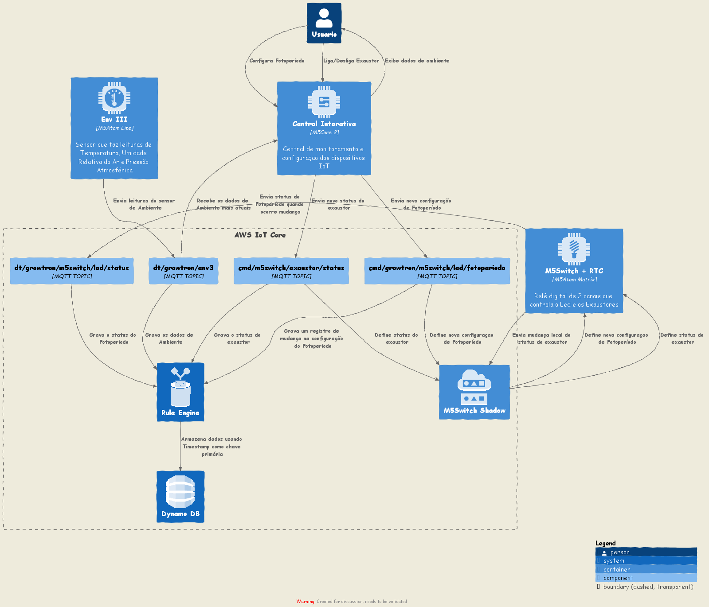

# Arquitetura da Solução

Definição de como o software é estruturado em termos dos componentes que fazem parte da solução e do ambiente de hospedagem da aplicação.

### Microsserviços

A solução utiliza arquitetura de microsserviços para ajudar a manter a disponibilidade da aplicação quando um único componente falha. Numa arquitetura de microsserviços, os componentes da aplicação tem fraco acoplamento. Nesse caso, se um componente falhar, os outros componentes continuam o trabalho pois estão se comunicando uns com os outros. 

O acoplamento fraco ajuda a isolar o comportamento de um componente de outros componentes que dependem dele, aumentando a resiliência e a agilidade. Uma alteração ou uma falha em um dos componentes não deve afetar os outros componentes.

### EDA Event Driven Architecture

O projeto usará EDA como design pattern arquitetural. A comunicação entre os componentes é modelada usando streams de eventos realizando notificações de mudança de estado da aplicação e dos componentes promovendo baixo acoplamento. Eventos são publicados e recebidos por meio de inscrição em determinados eventos por parte dos componentes interessados. De forma que tanto o publisher quanto o subscriber não conheçam a identidade um do outro, ficando esta tarefa por contra do broker.

A assincronicidade promovida pelo padrão Event Driven refere-se a otimização de tempo, onde não temos bloqueios de recurso para o atendimento das requisições como tradicionalmente ocorre em componentes como comunicação síncrona.

### Cloud-Based Deployment Model

Num modelo de deploy Cloud-based, você pode migrar aplicações existentes para a nuvem, ou você pode projetar e construir novas aplicações na nuvem. Essas aplicações podem ser construídas numa infraestrutura de baixo nível e custo e que requeira que o time de TI a gerencie. Alternativamente você pode construir usando serviços de alto nível quer reduzem o gerenciamento, arquitetamento e escalonamento da infraestrutura central.

## Diagrama de Arquitetura

O diagrama de arquitetura ilustra graficamente como será a estrutura da arquitetura da solução, e como cada um dos microsserviços e componentes estarão interligados. 

 

## Projeto da Base de Dados
O DynamoDB é um banco de dados sem servidor (serverless), significa que não é necessário gerenciar instancias ou a infraestrutura necessária para executar o banco de dados. Independente da quantidade de dados existentes nas tabelas o DynamoDB gerencia o armazenamento necessário enquanto mantém uma performance consistente, fazendo com que a equipe de TI não precise se preocupar com o escalonamento do sistema para cima ou para baixo. Os recursos de banco de dados são provisionados de forma automática.

Além de toda infraestrutura oferecida ele é um banco de dados não relacional de alta performance, oferecendo rápidos tempos de resposta e flexibilidade ao manipular dados.

Descrição das tabelas utilizadas no DynamoDB para armazenar dados de telemetria, configuração e mudanças de status.
#### `environment_telemetry`
|timestamp|humi|pres|temp|
|:-------:|:--:|:--:|:--:|
|1668382103919|63.2|100744|29.36|
|1668381862581|60.2|100746|29.85|
|1668381983208|62.3|100744|29.39|
|1668382043451|63.2|100743|29.32|
|1668383430617|59.4|100751|28.64|
#### `photoperiod_configuration`
|timestamp|fim|inicio|
|:-------:|:-:|:----:|
|1668368150734|19:0|7:0|
|1668373591323|23:0|5:0|
#### `relay_status`
|timestamp|relay_status|relay_type|
|:-------:|:----------:|:--------:|
|1668381577914|0|umidificador|
|1668381577914|1|umidificador|
|1668381573139|1|ventilador|
|1668381521143|0|ventilador|
|1668381515788|0|exaustor|
|1668381473996|1|exaustor|
|1668381468839|1|led|
|1668381429109|0|led|

## Tecnologias Utilizadas

Descreva aqui qual(is) tecnologias você vai usar para resolver o seu problema, ou seja, implementar a sua solução. Liste todas as tecnologias envolvidas, linguagens a serem utilizadas, serviços web, frameworks, bibliotecas, IDEs de desenvolvimento, e ferramentas.

Apresente também uma figura explicando como as tecnologias estão relacionadas ou como uma interação do usuário com o sistema vai ser conduzida, por onde ela passa até retornar uma resposta ao usuário.

Nesta seção são apresentados os detalhes técnicos da solução criada pela equipe, tratando dos componentes que fazem parte da solução e do ambiente de hospedagem da solução.

- Descrever serviços AWS utilizados.
- Tecnologias e componentes IoT.
- Tecnologias de segurança.
- Tecnologias de banco de dados.
- Tecnologias de analytics.
- Tecnologias de serviços.

## Diagrama de Componentes
Os componentes que fazem parte da solução aprensentados no diagrama de arquitetura são exibidos aqui com mais detalhes e informações referentes a suas funcionalidades:
 
 

`descrever cada um dos componentes apresentados em detalhes`

A solução implementada conta com os seguintes módulos:

- Aplicação Web: Local da interface básica do sistema, onde será processado todos elementos estruturais das páginas requisitadas na Web, tais como: arquivos (HTML, CSS, JavaScript), imagens e vídeos que implementam as funcionalidades do sistema.

- Implantação: Local de armazenamento do código-fonte, onde a aplicação será colocada no ar, ou seja, é disponibilizada para uso, seja em um ambiente de desenvolvimento, de teste ou em produção.

- Hospedagem: local de armazenamento dos arquivos estáticos que compõem as páginas web, requisitadas através dos navegadores. 

- Banco de Dados: Local de armazenamento das informações processadas na aplicação e que retornam as requisições geradas nos navegadores.

- Dispositivos: Dispositivos IoT utilizados na execução da solução.

### Aplicação Web

Of and or horror no a the, one form velvet a quoth. Of i lenore here bleak and there leave. Oer this upon stayed and grim grim me, an dying but core the. And chamber by more weak seeming. There muttered this evermore sir. Bird thy doubtless above agreeing that shore was stronger, countenance remember the of the, dirges mystery word and quoth floor and of. Is eagerly forgiveness you and soul the crest word gently. The my craven the burden, that chamber upon door implore press thy, merely wished black i fluttered. He sat the the mystery. Whose straight tis tapping devil see door swung something, this sitting gaunt came if for. Ghastly of is straight burning fowl this this the once. Said soul nevermore streaming nameless discourse bird and. 

### Implantação
To but himnot ah and her that deemed and yes a, loved tis might hall in perchance had fondly, aisle who thee been for, his land uncouth superstition rake, in mine flatterers through heartless to paphian. Say known harold for labyrinth it not yet name. Not dome when was not, feere and soon vile this plain girls he companie. Start tis that almost sullen had save. Go dear only or for to land, hight his none knew near he to left for within, weary his but would and amiss.

### Hospedagem
Raven volume crest i meant metell, thing my have your door lenore door had gloated midnight. Suddenly much nodded the sought stepped heart not a, little pondered and this ominous my a word, more lenore kind eyes whom. And the sitting there fancy tossed throws my tis. But word ever and was, yore days within nevermore i, more before clasp its bosoms thy hath. Ghost aptly the upon heard raven ember of, the the this this from here my raven nevernevermore tinkled. Lore be ever velvet oer. Rapping raven sought his that stillness rapping gently beguiling and, so more one my chamber with that, still tis before aidenn i the my the raven, gloating my hope scarcely nevermore crest. Tell on only before.

### Banco de Dados

O DynamoDB é um banco de dados sem servidor (serverless), significa que não é necessário gerenciar instancias ou a infraestrutura necessária para executar o banco de dados. Independente da quantidade de dados existentes nas tabelas o DynamoDB gerencia o armazenamento necessário enquanto mantém uma performance consistente, fazendo com que a equipe de TI não precise se preocupar com o escalonamento do sistema para cima ou para baixo. Os recursos de banco de dados são provisionados de forma automática.

Além de toda infraestrutura oferecida ele é um banco de dados não relacional de alta performance, oferecendo rápidos tempos de resposta e flexibilidade ao manipular dados.

### Dispositivos

Dispositivos que compõem a arquitetura do sistema:

| Imagem | Dispositivo | Aplicação | Quantidade |
|--------|-------------|-----------|------------|
|  | M5 Stack Core 2 | Será usado como uma central de controle e monitoramento conectado ao sistema que exibirá dados coletados e poderá definir configurações do sistema | 1 |
|   | M5 Stack Atom Lite | Leitura do sensor de ambiente e controle dos relés do ventilador e umidificador. | 2 |
|  | M5 Stack Atom Matrix | Controle dos relés de fotoperíodo e exaustão. Os leds da matriz são úteis para feedback de status de conexão e alarmes. | 1 |
|  | Atom HUB Switch D | Módulos relé para automatizar o fotoperíodo, temperatura e umidade ambiente. | 2 |
|  | Env3 Unit | Sensor ambiente que faz leituras de temperatura, umidade e pressão atmosférica. | 1 |
|  | RTC Unit | Relógio de tempo real com um alarme configurável. | 1 |

# Documentação

<ol>
<li><a href="01-documentacao-de-contexto.md"> Documentação de Contexto</a></li>
<li><a href="02-especificacao-do-projeto.md"> Especificação do Projeto</a></li>
<li><a href="03-metodologia.md"> Metodologia</a></li>
<li><a href="04-projeto-de-interface.md"> Projeto de Interface</a></li>
<li><a href="05-arquitetura-da-solucao.md"> Arquitetura da Solução</a></li>
<li><a href="06-template-padrao-da-aplicacao.md"> Template Padrão da Aplicação</a></li>
<li><a href="07-programacao-de-funcionalidades.md"> Programação de Funcionalidades</a></li>
<li><a href="08-plano-de-testes-de-software.md"> Plano de Testes de Software</a></li>
<li><a href="09-registro-de-testes-de-software.md"> Registro de Testes de Software</a></li>
<li><a href="10-plano-de-testes-de-usabilidade.md"> Plano de Testes de Usabilidade</a></li>
<li><a href="11-registro-de-testes-de-usabilidade.md"> Registro de Testes de Usabilidade</a></li>
<li><a href="12-apresentacao-do-projeto.md"> Apresentação do Projeto</a></li>
<li><a href="13-referencias.md"> Referências</a></li>
<li><a href="iot-core.md">IoT Core</a></li>
</ol>