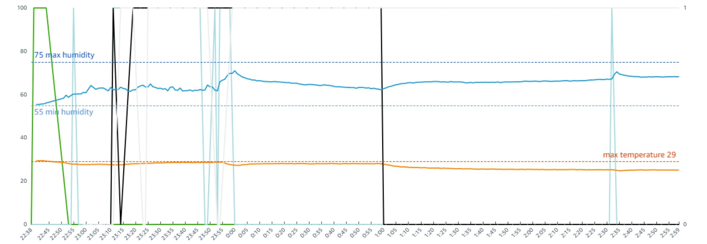

# Apresentação

Conjunto de slides em um arquivo PowerPoint ou PDF com a apresentação do projeto contemplando todos os itens trabalhados nos demais artefatos.

## Título do Projeto

Nome e marca do projeto

## Identidade Visual (Marca, Design)

Utilizar figuras, imagens, e cores dentro do contexto da solução proposta, de forma a manter a temática do problema.

> **Links Úteis**:
> - [10 dicas de design para slides](https://rockcontent.com/blog/design-para-slides/)
> - [7 dicas de design para criar apresentações de PowerPoint incríveis e eficientes](https://www.shutterstock.com/pt/blog/7-dicas-de-design-para-criar-apresentacoes-de-powerpoint-incriveis-e-eficientes)
> - [Especialista do TED dá 10 dicas para criar slides eficazes e bonitos](https://soap.com.br/blog/especialista-do-ted-da-10-dicas-para-criar-slides-eficazes-e-bonitos)

## Conjunto de Slides (Estrutura)

Distribuir de forma coerente o conteúdo a ser apresentado, dentro do tempo determinado. Importante ressaltar a importância da descrição clara de todo o andamento do projeto, insumos gerados e requisitos atendidos.
 
> **Links Úteis**:
> - [A regra 10-20-30 para apresentações de sucesso](https://revistapegn.globo.com/Noticias/noticia/2014/07/regra-10-20-30-para-apresentacoes-de-sucesso.html)
> - [Top Tips for Effective Presentations](https://www.skillsyouneed.com/present/presentation-tips.html)
> - [How to make a great presentation](https://www.ted.com/playlists/574/how_to_make_a_great_presentation)

## Monitoramento de Automação de Ambiente
#### Média de Temperatura e Umidade Relativa do Ar por Minuto e Estado dos Relés
O estado dos relés influencia diretamente na temperatura e umidade do ambiente. A umidade relativa do ar deve ficar entre os limites de 55% e 75% enquanto a temperatura deve ficar a baixo de 29 °C. Um regra é aplicada a cada atualização de telemetria ambiente que envia um evento para o dispositivo ligar ou desligar o umidificador ou o ventilador de acordo com os limites.

# Documentação

<ol>
<li><a href="documentacao-de-contexto.md"> Documentação de Contexto</a></li>
<li><a href="especificacao-do-projeto.md"> Especificação do Projeto</a></li>
<li><a href="funcionalidades.md"> Funcionalidades</a></li>
<li><a href="metodologia.md"> Metodologia</a></li>
<li><a href="projeto-de-interface.md"> Projeto de Interface</a></li>
<li><a href="template-padrao-da-aplicacao.md"> Template Padrão da Aplicação</a></li>
<li><a href="arquitetura-da-solucao.md"> Arquitetura da Solução</a></li>
<li><a href="iot-core.md">IoT Core</a></li>
<li><a href="apresentacao-do-projeto.md"> Apresentação do Projeto</a></li>
<li><a href="referencias.md"> Referências</a></li>
</ol>